# **Лабораторная работа №1. Виртуальный сервер**
## **Информация о студенте**

**Имя и фамилия:** Mamaliga Artur
**Группа:** I2302
**Дата выполнения:** 02.10.2025

---

## **Описание задачи**

В данной лабораторной работе рассматривается процесс виртуализации операционной системы, а также установка и настройка виртуального HTTP-сервера с использованием QEMU. В ходе выполнения работы устанавливается ОС Debian, настраивается веб-сервер Apache, СУБД MariaDB, PHP и CMS Drupal. Также рассматриваются базовые операции администрирования серверов.

---

## **Описание выполнения работы**
### Cоздание структуры папок и дискового образа

1. Создана папка `lab01`:
    
    ```
    mkdir lab01
    ```
    
2. В папке `lab01` создана папка `dvd` и файл `readme.md`:
    
    ```
    mkdir lab01/dvd
    touch lab01/readme.md
    ```
    
3. В папку `dvd` перемещен образ `debian.iso`:
    
    ```
    mv debian.iso lab01/dvd/
    ```

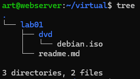
### Установка Debian в виртуальную машину

Скачиваю дистрибутив Debian на Ubuntu 24.04 LTS при помощи команды wget
```bash
wget https://cdimage.debian.org/debian-cd/current/amd64/iso-dvd/debian-12.9.0-amd64-DVD-1.iso
```

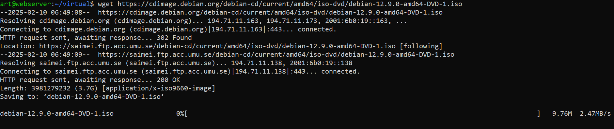

Далее устанавливаю qemu

```bash
sudo apt install qemu-system
```


Я создаю образ диска для виртуальной машины размером 8 ГБ в папке `lab01`, используя утилиту `qemu-img`. Я выбираю формат `qcow2` и помещаю этот образ в указанную папку через консоль. 
```bash
qemu-img create -f qcow2 debian.qcow2 8G
```

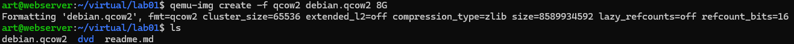

ввожу 
```bash
qemu-system-x86_64 -hda debian.qcow2 -cdrom dvd/debian.iso -boot d -m 2G 
```

и открывается окно qemu:
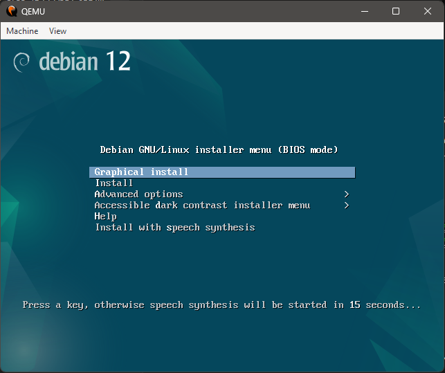

Я устанавливаю ОС Debian, указывая параметры установки: я задаю хостовое имя `debian.localhost`, создаю пользователя под именем `user`, и назначаю ему пароль `password`.
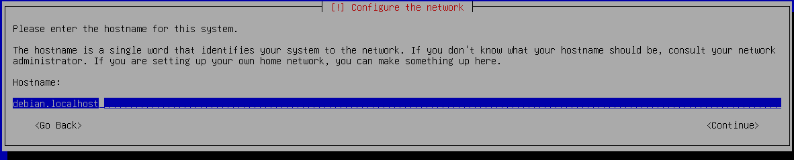
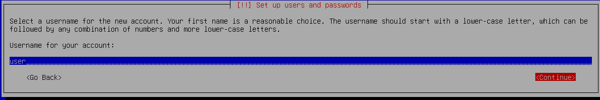

Я выбрал пункт `All files in one partition (recommended for new users)`. Этот вариант создаёт одну общую партицию для всех данных, что удобно и рекомендуется для новых пользователей.
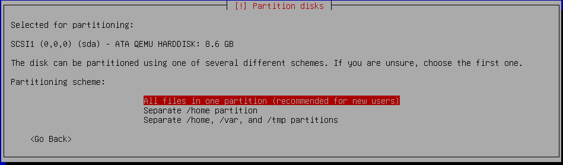

процесс установки
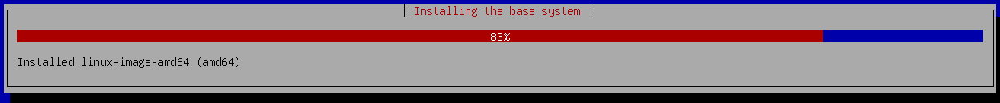

### Запуск виртуальной машины и настройка сети

```bash
qemu-system-x86_64 -hda debian.qcow2 -m 2G -smp 2 -device e1000,netdev=net0 \
-netdev user,id=net0,hostfwd=tcp::1080-:80,hostfwd=tcp::1022-:22
```
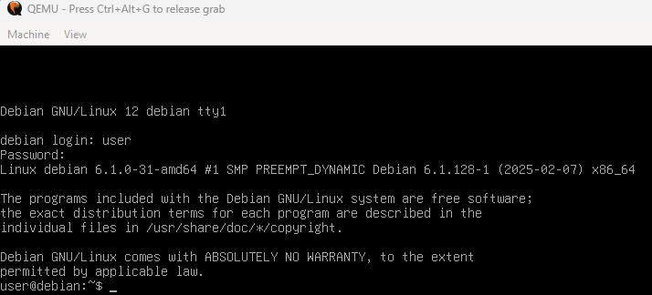
### Установка LAMP
```bash
su
apt update -y
apt install -y apache2 php libapache2-mod-php php-mysql mariadb-server mariadb-client unzip
````
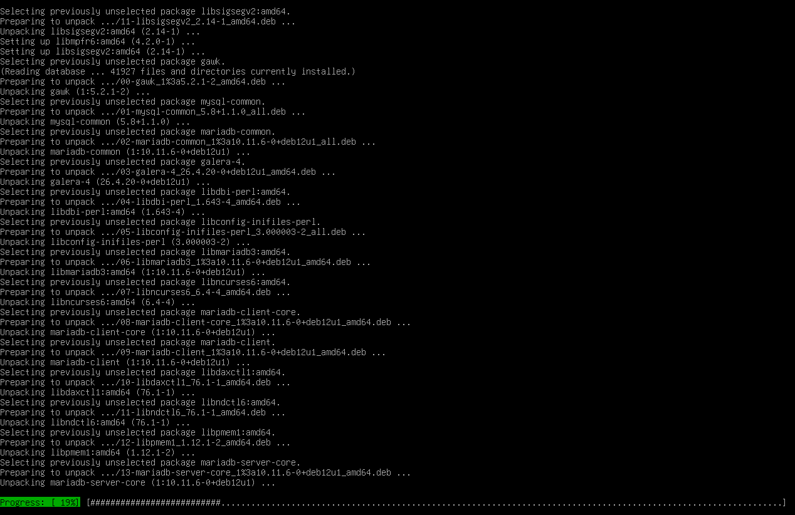

### Установка PhpMyAdmin и Drupal
```bash
wget https://files.phpmyadmin.net/phpMyAdmin/5.2.2/phpMyAdmin-5.2.2-all-languages.zip
wget https://ftp.drupal.org/files/projects/drupal-11.1.1.zip
```

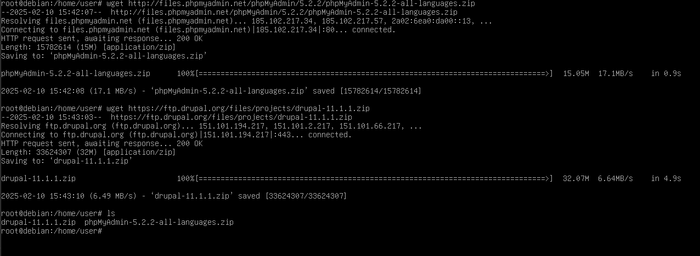
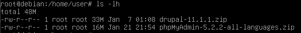

Распаковка файлов:
```bash
mkdir /var/www
unzip phpMyAdmin-5.2.2-all-languages.zip -d /var/www/
mv /var/www/phpMyAdmin-5.2.2-all-languages /var/www/phpmyadmin
unzip drupal-11.1.1.zip -d /var/www/
mv /var/www/drupal-11.1.1 /var/www/drupal
```

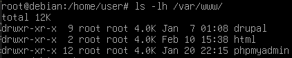

### Настройка базы данных для Drupal

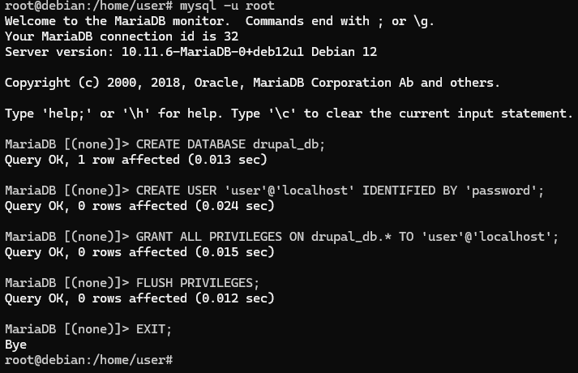

### Настройка виртуальных хостов Apache

Создание файла `/etc/apache2/sites-available/01-phpmyadmin.conf`:
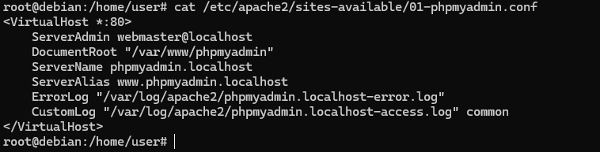

Создание файла `/etc/apache2/sites-available/02-drupal.conf`:
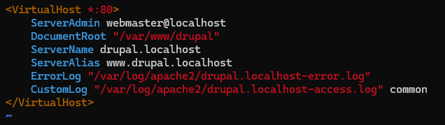

### Включение конфигураций и перезапуск Apache

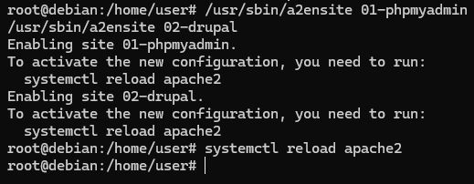

Добавление записей в `/etc/hosts`:
```bash
echo "127.0.0.1 phpmyadmin.localhost" >> /etc/hosts
echo "127.0.0.1 drupal.localhost" >> /etc/hosts
```

### Запуск и тестирование
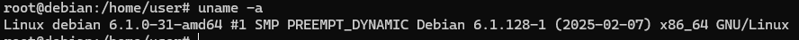
Выводится полная информация о системе
ОС, хостнэйм, версия ядра, версия сборки ядра, дистрибутив, архитектура, полное название операционной системы.

Перезагрузка вебсервера происходит при помощи рестрарта его сервиса 
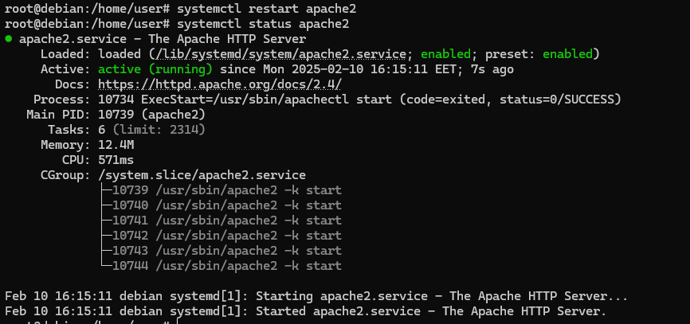

### Результат
Пример доступности сайтов
`http://drupal.localhost:1080`
`http://phpmyadmin.localhost:1080`

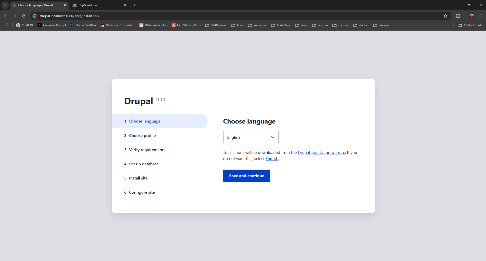
упсс...
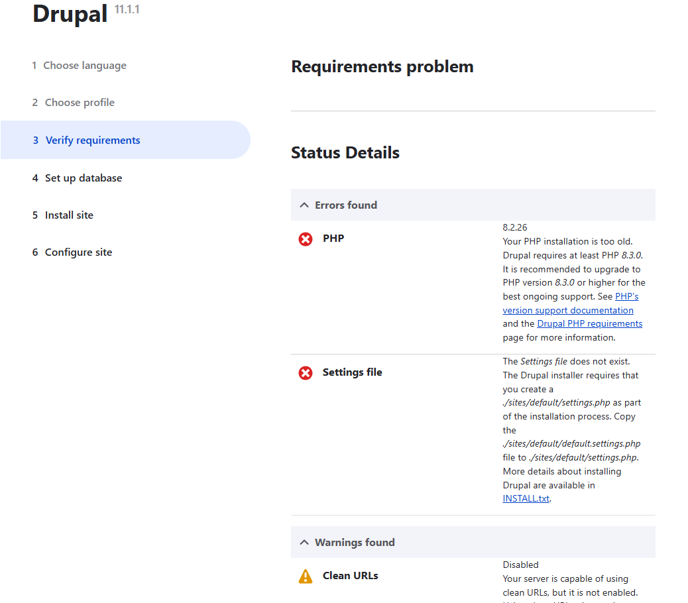


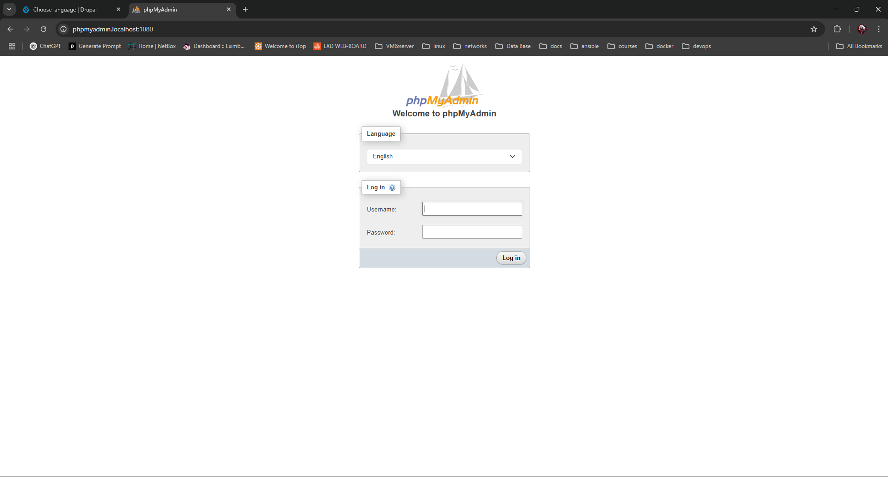
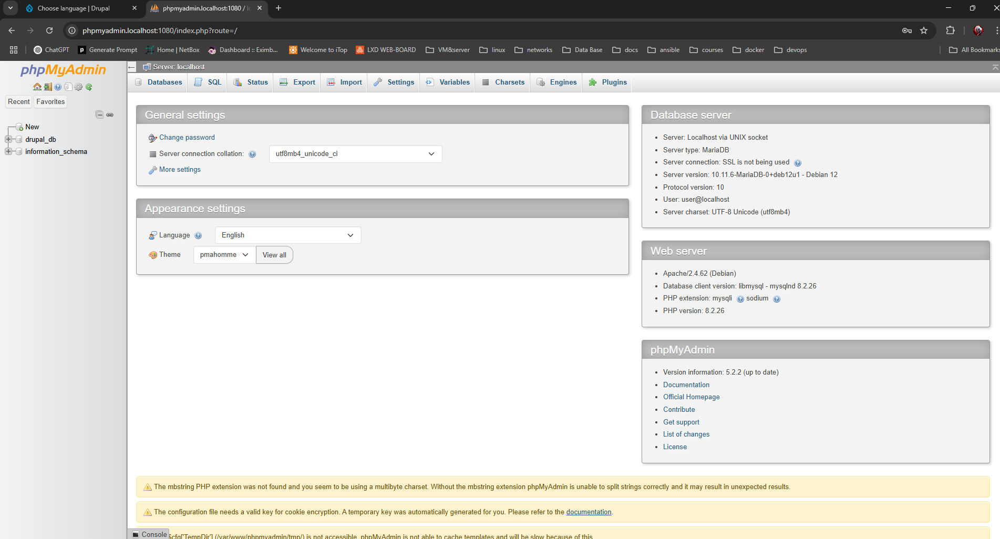

# **Ответы на поставленные вопросы**
1. **Как скачать файл через** wget?

  ```bash
   wget <URL>
   ```

2. **Зачем необходимо создавать для каждого сайта свою базу и своего пользователя?**

- Для разделения данных разных сайтов. Также это способствует изоляции данных, логическое разделение упрощает их управление, упращает масштабируемость и повышает производительность. Отдельные пользователи это один из шагов к обеспечению защиты своих серверов.

3. **Как поменять доступ к системе управления БД на порт `1234`?**

- В файле `/etc/mysql/my.cnf изменить `port = 1234`.

4. **Какие преимущества дает виртуализация?**

- Изолированное тестирование, экономное, контролируемое и эффективное распределение ресурсов, масштабируемость.

5. **Почему важно настроить время?**

- Для корректности логов, работы сертификатов, синхронизации и бэкапов, корректность взаимодействия с другими серверами.

6. **Сколько места занимает виртуальный диск?**
```bash  
Artur.Mamaliga@LP-PF224A3D UCRT64 ~/lab01
$ du -sh debian.qcow2
3.3G    debian.qcow2	 
```


7. **Какие есть рекомендации по разбиению диска для серверов? Почему рекомендуется так разбивать диск?**

Для обычных задач я не разбиваю каким то особым образом диски, а оставляю все по стандарту, маунт все на / для простых решений этого более чем достаточно, разбивка диска же зависит от конкретных задач. Если важны логи и их очень много и они могут забить систему которая критическая, то тогда наверное лучше замаунтить /var  отдельно. В целом идея такая, что если что то постоянно растет и ему может понадобиться место лучше это положить в отдельную партицию потому что нарастить размер отдельной партиции проще чем / (рута), который наживаю не заэкстендишь. Но мое мнение на данный счет пока, что это зависит сугубо от ситуации.

# **Вывод**

В данной лабораторной работе были освоены навыки по настройке виртуального сервера с использованием QEMU. Были рассмотрены основные этапы установки операционной системы Debian, конфигурирования веб-сервера Apache и развертывания CMS Drupal.

Благодаря использованию виртуализации удалось:

- Создать изолированное окружение для тестирования;

- Эффективно управлять ресурсами хостовой машины;

- Опробовать настройку сетевого взаимодействия внутри виртуальной машины.


Настроенная среда позволит легко разворачивать и тестировать веб-приложения в безопасной и управляемой среде. В ходе работы были даны ответы на важные вопросы, связанные с администрированием веб-серверов и баз данных. Результаты данной лабораторной работы могут быть использованы в будущих задачах по серверному администрированию и DevOps.