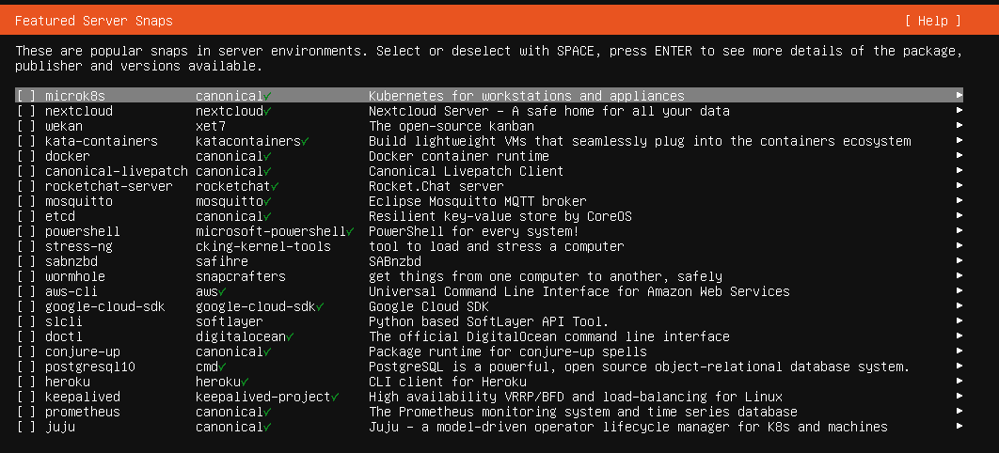
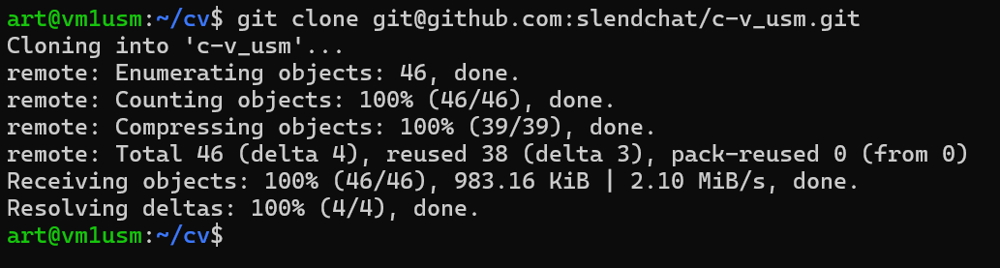
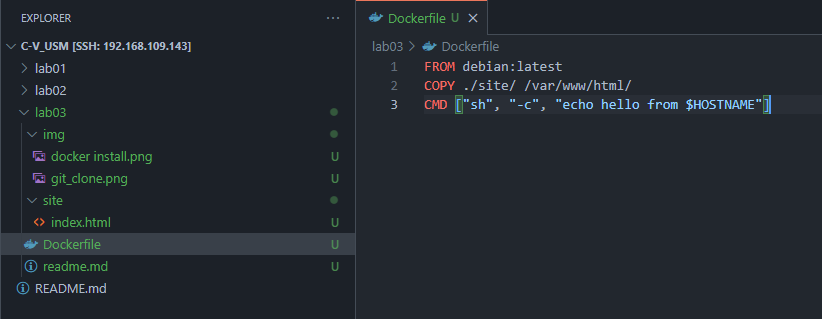
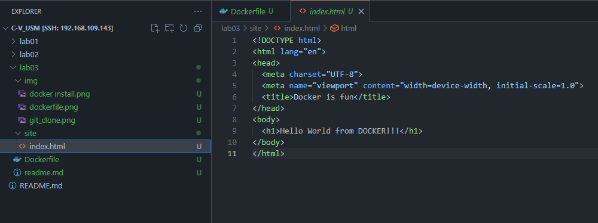

# Лабораторная работа 03: Основы контейнеризации

## Цель работы
Данная лабораторная работа знакомит с основами контейнеризации и подготавливает рабочее место для выполнения следующих лабораторных работ.

## Задание
1. Установить Docker и проверить его работоспособность.
2. Создать репозиторий `containers02` и склонировать его себе на компьютер.
3. Создать в папке `containers02` файл `Dockerfile` со следующим содержимым:


```dockerfile
FROM debian:latest
COPY ./site/ /var/www/html/
CMD ["sh", "-c", "echo hello from $HOSTNAME"]
```

4. Создать в папке проекта `site` и добавить в нее файл `index.html` с произвольным содержимым.
5. Выполнить команду для сборки контейнера:
   ```bash
   docker build -t containers02 .
   ```
6. Запустить контейнер и проверить его работоспособность:
   ```bash
   docker run --name containers02 containers02
   ```
7. Удалить контейнер и повторно запустить его в интерактивном режиме:
   ```bash
   docker rm containers02
   docker run -ti --name containers02 containers02 bash
   ```
8. Проверить наличие файла `index.html` в контейнере:
   ```bash
   cd /var/www/html/
   ls -l
   ```
9. Закрыть сессию контейнера командой `exit`.
10. Создать файл `README.md` с описанием проекта.

## Выполнение работы
### Установка Docker
Docker был установлен при установке системы и проверен на работоспособность.



```bash
docker -v
Docker version 27.2.0, build 3ab4256
```

### Клонирование репозитория
Репозиторий `c-v_usm` (так как у меня изначально был создан репозиторий по предмету) был успешно склонирован с помощью команды:
```bash
git clone git@github.com:slendchat/c-v_usm.git
```



### Создание Dockerfile
Файл `Dockerfile` был создан со следующим содержимым:
```dockerfile
FROM debian:latest
COPY ./site/ /var/www/html/
CMD ["sh", "-c", "echo hello from $HOSTNAME"]
```



### Создание директории site с index.html
Создаю директорию и создаю там файл index.html




### Сборка контейнера
Контейнер был успешно собран с помощью команды:
```bash
sudo docker build -t containers02 .
```
Вывод команды:
```
[+] Building 30.7s (7/7) FINISHED
[2/2] COPY ./site/ /var/www/html/
```

Контейнер собирался 30.7 секунд, изза медленного интернета во время скачивания прообраза.

### Запуск контейнера
Контейнер был запущен с помощью команды:
```bash
sudo docker run --name containers02 containers02
```
Вывод в консоли:
```
hello from 805c529b1264
```

### Проверка содержимого контейнера
После удаления и повторного запуска контейнера в интерактивном режиме:
```bash
sudo docker rm containers02
sudo docker run -ti --name containers02 containers02 bash
```
Проверяем содержимое папки `/var/www/html/`:
```bash
cd /var/www/html/
ls -l
```
Вывод:
```
total 4
-rw-rw-r-- 1 root root 237 Feb 28 09:48 index.html
```


### Завершение работы
Выход из контейнера:
```bash
exit
```

## Выводы
В ходе лабораторной работы:
- Был установлен Docker.
- Создан и настроен репозиторий с Dockerfile и сайтом.
- Собран и запущен контейнер.
- Проверена работа контейнера, включая копирование файлов в `/var/www/html/`.
- Успешно выполнены тесты работы контейнера.

## Используемые источники
1. [Официальная документация Docker](https://docs.docker.com/build/)

