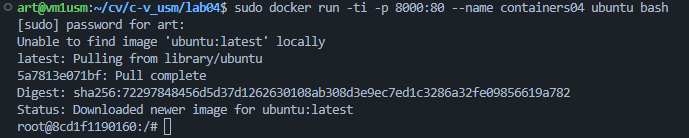
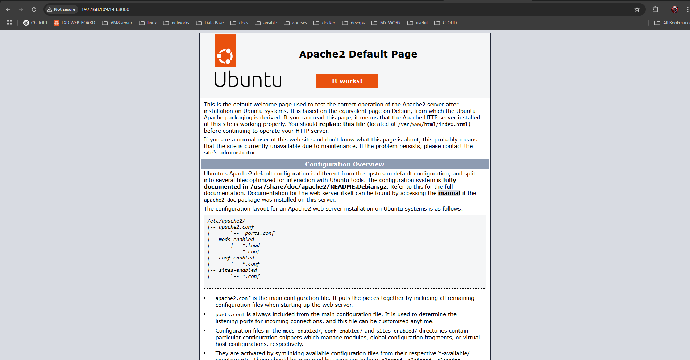

# Лабораторная работа 04: Основные команды ОС Debian/Ubuntu и работа с Docker

## Цель работы
Данная лабораторная работа призвана напомнить основные команды ОС Debian/Ubuntu. Также она позволит познакомиться с Docker и его основными командами.

## Задание
Запустить контейнер Ubuntu, установить Web-сервер Apache и вывести в браузере страницу с текстом "Hello, World!".

## Подготовка
Для выполнения данной работы необходимо иметь установленный на компьютере Docker.

## Выполнение

### 1. Запуск контейнера Ubuntu
Запустим новый контейнер Ubuntu с пробросом порта 8000:
```bash
docker run -ti -p 8000:80 --name containers04 ubuntu bash
```
**Объяснение:**
- `docker run` — запускает новый контейнер.
- `-ti` — включает интерактивный режим (`i`) с поддержкой терминала (`t`).
- `-p 8000:80` — пробрасывает порт 80 контейнера на 8000 хост-машины, чтобы можно было открыть веб-сайт через браузер.
- `--name containers04` — задаёт имя контейнеру.
- `ubuntu` — образ операционной системы, который будет использоваться.
- `bash` — запускает оболочку Bash внутри контейнера.



### 2. Установка Apache
В терминале контейнера выполним команды для установки и запуска веб-сервера Apache:
```bash
apt update  
apt install apache2 -y  
service apache2 start  
```
**Объяснение:**
- `apt update` — обновляет список доступных пакетов и их версий.
- `apt install apache2 -y` — устанавливает веб-сервер Apache. Флаг `-y` подтверждает установку без запроса у пользователя.
- `service apache2 start` — запускает сервис веб-сервера Apache.

### 3. Проверка работы веб-сервера
Откроем браузер и перейдём по адресу `http://localhost:8000`. 
На экране отобразится стандартная стартовая страница Apache:



### 4. Создание веб-страницы
Заменим содержимое файла `index.html` на наш собственный текст:
```bash
echo '<h1>Hello, World!</h1>' > /var/www/html/index.html
```
**Объяснение:**
- `echo '<h1>Hello, World!</h1>' > /var/www/html/index.html` — создаёт или перезаписывает файл `index.html`, добавляя в него HTML-код с заголовком "Hello, World!".

Теперь обновим страницу в браузере. Мы увидим текст `Hello, World!`.


### 5. Проверка конфигурации Apache
Посмотрим содержимое конфигурационного файла `000-default.conf`:
```bash
cd /etc/apache2/sites-enabled/
cat 000-default.conf
```
**Объяснение:**
- `cd /etc/apache2/sites-enabled/` — переходит в директорию с файлами конфигурации виртуальных хостов Apache.
- `cat 000-default.conf` — выводит содержимое файла конфигурации.

Этот файл содержит настройки виртуального хоста Apache. Важно отметить, что `DocumentRoot` указывает на папку `/var/www/html/`, где находится наш `index.html`.
```bash
<VirtualHost *:80>
        ServerAdmin webmaster@localhost
        DocumentRoot /var/www/html
        ErrorLog ${APACHE_LOG_DIR}/error.log
        CustomLog ${APACHE_LOG_DIR}/access.log combined
</VirtualHost>
```
**Объяснение**
Определение виртуального хоста
`<VirtualHost *:80>`
`*` означает, что этот виртуальный хост будет принимать запросы на всех IP-адресах сервера.
`:80` означает, что хост будет работать на 80-м порту (HTTP).

Контактный email администратора
`ServerAdmin webmaster@localhost`
Этот email будет указан в сообщениях об ошибках сервера.

Директива DocumentRoot
`DocumentRoot /var/www/html`
Определяет корневую папку, из которой Apache будет загружать файлы веб-сайта.
В данном случае, это `/var/www/html`, то есть главная страница будет `index.html`, находящийся в этой директории.

Логирование
`ErrorLog ${APACHE_LOG_DIR}/error.log`
`CustomLog ${APACHE_LOG_DIR}/access.log combined`
`ErrorLog` – путь к файлу, где записываются ошибки Apache.
`CustomLog` – путь к файлу журнала запросов (access.log), формат записи - combined, что включает информацию о запросах, браузере, IP и т. д.


### 6. Завершение работы
Выходим из контейнера:
```bash
exit
```
**Объяснение:**
- `exit` — завершает сеанс терминала и останавливает контейнер.

### 7. Просмотр списка контейнеров
Проверяем список запущенных контейнеров:
```bash
sudo docker ps -a
```
**Объяснение:**
- `docker ps -a` — выводит список всех контейнеров, включая остановленные.

Вывод показывает, что контейнер `containers04` завершил работу:
```
CONTAINER ID   IMAGE       COMMAND   CREATED         STATUS                     PORTS       NAMES
8cd1f1190160   ubuntu      "bash"    5 minutes ago   Exited (0) 7 seconds ago               containers04
```

### 8. Удаление контейнера
Удаляем контейнер:
```bash
sudo docker rm containers04
```
**Объяснение:**
- `docker rm containers04` — удаляет контейнер `containers04`.

После удаления снова проверим список контейнеров:
```bash
sudo docker ps -a
```
Контейнер `containers04` больше не отображается.
```bash
sudo docker ps -a
CONTAINER ID   IMAGE     COMMAND   CREATED   STATUS    PORTS     NAMES
```

## Выводы
В ходе лабораторной работы:
- Мы запустили контейнер Ubuntu в Docker с пробросом порта 8000.
- Установили и запустили веб-сервер Apache внутри контейнера.
- Проверили доступность веб-сервера через браузер.
- Изменили содержимое веб-страницы.
- Изучили конфигурацию Apache.
- Завершили работу и удалили контейнер.

## Используемые источники
1. [Официальная документация Docker](https://docs.docker.com/)
2. [Документация Apache](https://httpd.apache.org/)

