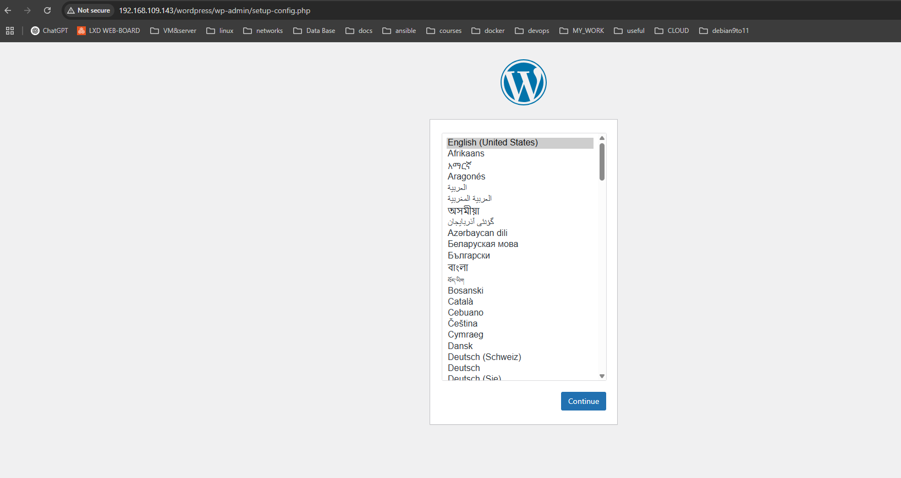
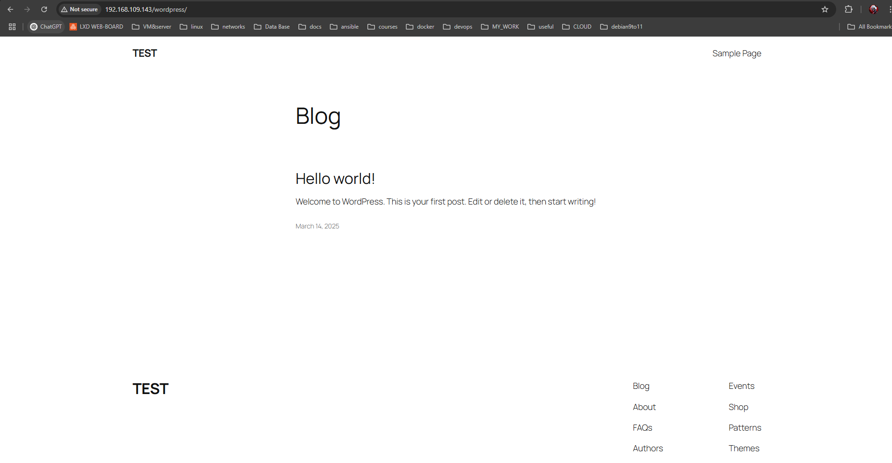
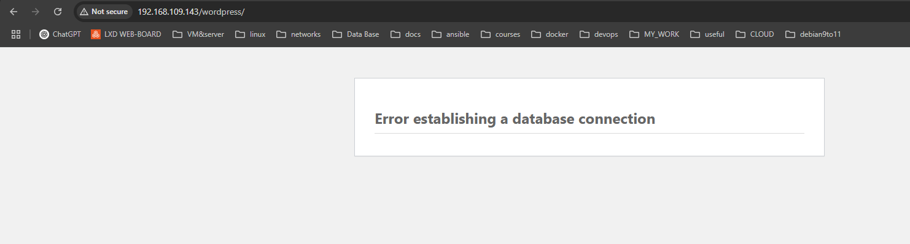
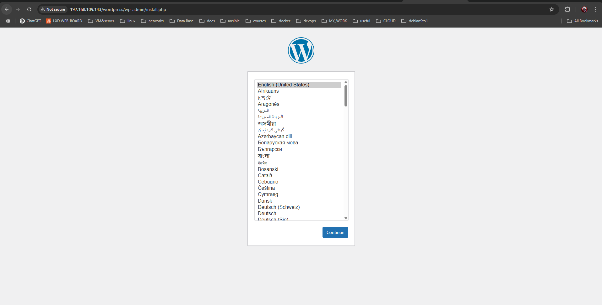
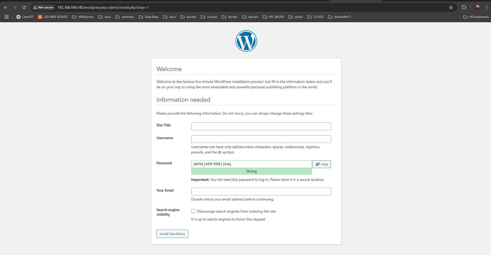

cd lab05
mkdir files/apache2
mkdir files/php
mkdir files/mariadb


Постройте образ контейнера с именем apache2-php-mariadb.
docker build -t apache2-php-mariadb .
[+] Building 183.2s (6/6) FINISHED   

Создайте контейнер apache2-php-mariadb из образа apache2-php-mariadb и запустите его в фоновом режиме с командой запуска bash.
docker run -dit -P --name apache2-php-mariadb apache2-php-mariadb
(-d detached -i -t interactive)

docker cp apache2-php-mariadb:/etc/apache2/sites-available/000-default.conf files/apache2/
docker cp apache2-php-mariadb:/etc/apache2/apache2.conf files/apache2/
docker cp apache2-php-mariadb:/etc/php/8.2/apache2/php.ini files/php/
docker cp apache2-php-mariadb:/etc/mysql/mariadb.conf.d/50-server.cnf files/mariadb/

Successfully copied 3.07kB to /home/art/cv/c-v_usm/lab05/files/apache2/
Successfully copied 9.22kB to /home/art/cv/c-v_usm/lab05/files/apache2/
Successfully copied 75.8kB to /home/art/cv/c-v_usm/lab05/files/php/
Successfully copied 5.63kB to /home/art/cv/c-v_usm/lab05/files/mariadb/

.
├── Dockerfile
├── files
│   ├── apache2
│   │   ├── 000-default.conf
│   │   └── apache2.conf
│   ├── mariadb
│   │   └── 50-server.cnf
│   └── php
│       └── php.ini
└── readme.md

000-default.conf:
```
...
	ServerName localhost

	ServerAdmin artmamaliga8@gmail.com
	DocumentRoot /var/www/html

	DirectoryIndex index.php index.html
...
  ```

apache2.conf:
```
...
ServerName localhost
```

php.ini:
```
...
error_log = /var/log/php_errors.log
...
memory_limit = 128M
upload_max_filesize = 128M
post_max_size = 128M
max_execution_time = 120
```

50-server.cnf:
```
...
log_error = /var/log/mysql/error.log
...
```

.
├── Dockerfile
├── files
│   ├── apache2
│   │   ├── 000-default.conf
│   │   └── apache2.conf
│   ├── mariadb
│   │   └── 50-server.cnf
│   ├── php
│   │   └── php.ini
│   └── supervisor
│       └── supervisor.conf
└── readme.md

supervisor.conf:
```
[supervisord]
nodaemon=true
logfile=/dev/null
user=root

# apache2
[program:apache2]
command=/usr/sbin/apache2ctl -D FOREGROUND
autostart=true
autorestart=true
startretries=3
stderr_logfile=/proc/self/fd/2
user=root

# mariadb
[program:mariadb]
command=/usr/sbin/mariadbd --user=mysql
autostart=true
autorestart=true
startretries=3
stderr_logfile=/proc/self/fd/2
user=mysql
```

ADD cannot extract files with remote sources.
i used this structure:
```
ADD https://wordpress.org/latest.tar.gz /tmp/wordpress.tar.gz
RUN tar -xzf /tmp/wordpress.tar.gz -C /var/www/html/ && \
    rm /tmp/wordpress.tar.gz && \
    chown -R www-data:www-data /var/www/html/wordpress && \
    chmod -R 755 /var/www/html/wordpress
```


docker build -t apache2-php-mariadb .


docker run -d -p 80:80 --name apache2-php-mariadb apache2-php-mariadb

пишу docker logs apache2-php-mariadb

оказывается
could not find config file /etc/supervisor/conf.d/supervisord.conf

исправляю докерфайл

продую снова
docker run -d -p 80:80 --name apache2-php-mariadb apache2-php-mariadb

теперь
5cbfd0f23232   apache2-php-mariadb   "/usr/bin/supervisor…"   14 seconds ago   Up 12 seconds

проверяю содержимое /var/www/html
docker exec -it apache2-php-mariadb /bin/bash
ls -lh /var/www/html/
total 16K
-rw-r--r-- 1 root     root      11K Mar 14 12:22 index.html
drwxr-xr-x 5 www-data www-data 4.0K Feb 11 16:11 wordpress

Создание базы данных и пользователя
mysql

MariaDB [(none)]> CREATE DATABASE wordpress;
Query OK, 1 row affected (0.000 sec)

MariaDB [(none)]> CREATE USER 'wordpress'@'localhost' IDENTIFIED BY 'wordpress';
Query OK, 0 rows affected (0.003 sec)

MariaDB [(none)]> GRANT ALL PRIVILEGES ON wordpress.* TO 'wordpress'@'localhost';
Query OK, 0 rows affected (0.003 sec)

MariaDB [(none)]> FLUSH PRIVILEGES;
Query OK, 0 rows affected (0.001 sec)

MariaDB [(none)]> EXIT;
Bye

все команды успешно выполнены.




docker cp apache2-php-mariadb:/var/www/html/wordpress/wp-config.php files/wp-config.php

сайт до пересобрания:


Пересоберите образ контейнера с именем apache2-php-mariadb и запустите контейнер apache2-php-mariadb из образа apache2-php-mariadb. Проверьте работоспособность сайта WordPress.

закономерно сайт не встанет потому что база данных не настроена


добавляю код инициализации бд в bash скрипт который запускает также супервизор, вызываю его при помощи:
```
ENTRYPOINT ["/initsql.sh"]
```
и добавляю его выполнение при инициализации контейнера, данный код не изменит бд если сущности уже существуют.

docker build -t apache2-php-mariadb .
docker run -d -p 80:80 --name apache2-php-mariadb apache2-php-mariadb

схема создана, бд проинициализирована:
MariaDB [(none)]> SELECT user, host FROM mysql.user;
+-------------+-----------+
| User        | Host      |
+-------------+-----------+
| mariadb.sys | localhost |
| mysql       | localhost |
| root        | localhost |
| wordpress   | localhost |
+-------------+-----------+
4 rows in set (0.003 sec)

MariaDB [(none)]> SHOW DATABASES;
+--------------------+
| Database           |
+--------------------+
| information_schema |
| mysql              |
| performance_schema |
| sys                |
| wordpress          |
+--------------------+
5 rows in set (0.001 sec)

итог при сборке проекта сразу получаем:


