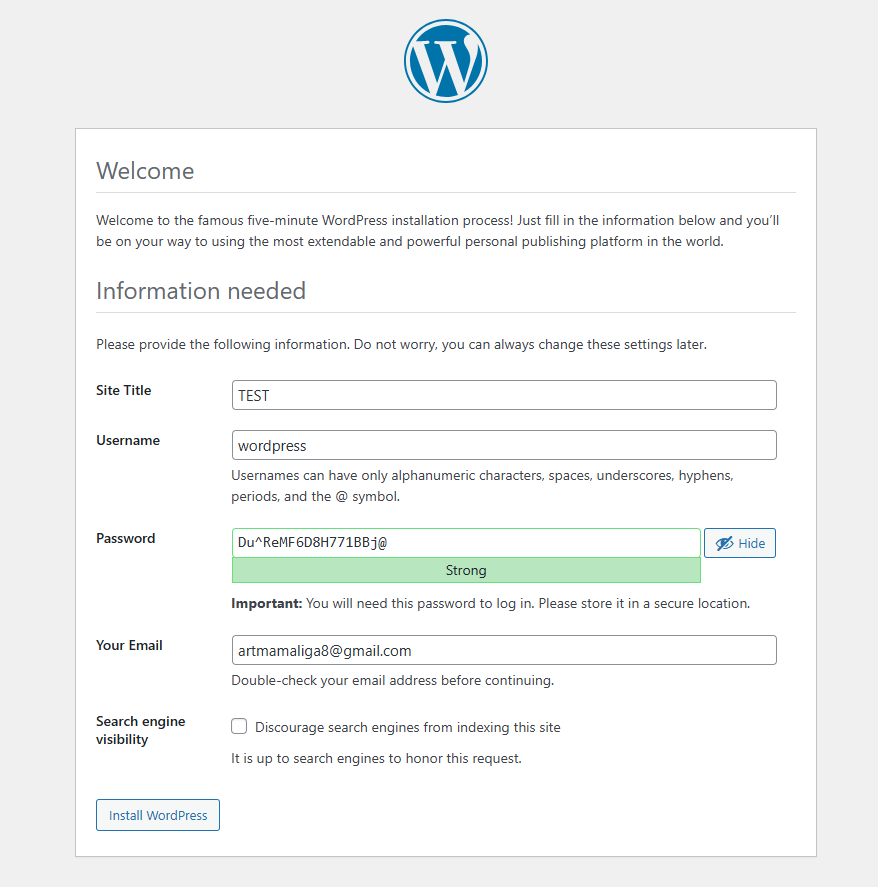
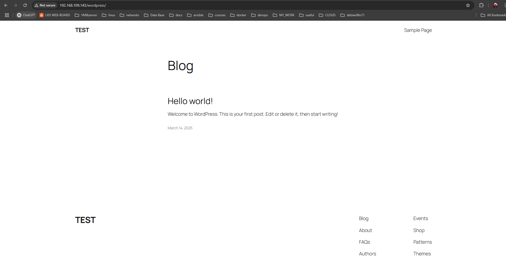
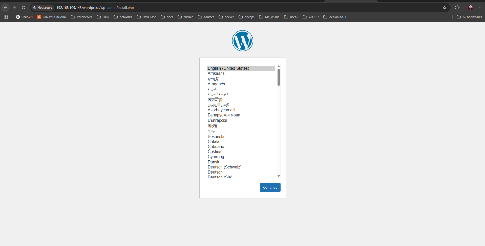
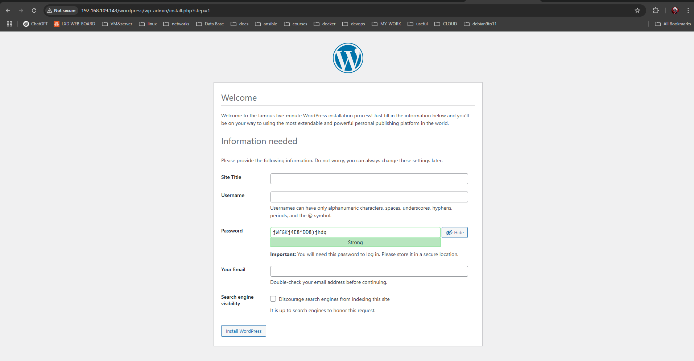

# Лабораторная работа 5: Запуск сайта в контейнере

## 1. Название лабораторной работы
Создание Docker-образа с Apache HTTP Server + PHP (mod_php) + MariaDB + WordPress

## 2. Цель работы
Научиться:
1. Создавать образ Docker, содержащий веб-сервер Apache и PHP.
2. Подключать и настраивать базу данных MariaDB внутри контейнера.
3. Настраивать WordPress на работающем веб-сервере.
4. Использовать Supervisor для управления несколькими службами в одном контейнере.
5. Организовывать структуру проекта: монтируемые тома, конфигурационные файлы и автоматическая инициализация БД.

## 3. Задание
1. Создать Dockerfile для сборки образа контейнера, содержащего:
   - Apache HTTP Server + PHP (mod_php);
   - MariaDB (с базой данных на монтируемом томе);
   - Сайт WordPress, доступный по порту **80** (в итоговом примере мы пробросили порт `80:80`, но условие может меняться).
2. Настроить конфигурационные файлы Apache, PHP, MariaDB.
3. Проверить работоспособность сайта WordPress (запустить контейнер и убедиться, что сайт открывается).

## 4. Описание выполнения работы
Выполнялось в директории **lab05**.

### 4.1 Извлечение конфигурационных файлов
```bash
cd lab05
mkdir files/apache2
mkdir files/php
mkdir files/mariadb

# создаю образ
docker build -t apache2-php-mariadb .

# инициализирую контейнер
docker run -dit -P --name apache2-php-mariadb apache2-php-mariadb
(-d detached -i -t interactive)

# копирую конфиги
docker cp apache2-php-mariadb:/etc/apache2/sites-available/000-default.conf files/apache2/
docker cp apache2-php-mariadb:/etc/apache2/apache2.conf files/apache2/
docker cp apache2-php-mariadb:/etc/php/8.2/apache2/php.ini files/php/
docker cp apache2-php-mariadb:/etc/mysql/mariadb.conf.d/50-server.cnf files/mariadb/

Successfully copied 3.07kB to /home/art/cv/c-v_usm/lab05/files/apache2/
Successfully copied 9.22kB to /home/art/cv/c-v_usm/lab05/files/apache2/
Successfully copied 75.8kB to /home/art/cv/c-v_usm/lab05/files/php/
Successfully copied 5.63kB to /home/art/cv/c-v_usm/lab05/files/mariadb/

.
├── Dockerfile
├── files
│   ├── apache2
│   │   ├── 000-default.conf
│   │   └── apache2.conf
│   ├── mariadb
│   │   └── 50-server.cnf
│   └── php
│       └── php.ini
└── readme.md
```

### 4.2 Изменения в конфигурационных файлах

**000-default.conf:**
```
...
\tServerName localhost

\tServerAdmin artmamaliga8@gmail.com
\tDocumentRoot /var/www/html

\tDirectoryIndex index.php index.html
...
```

**apache2.conf:**
```
...
ServerName localhost
```

**php.ini:**
```
...
error_log = /var/log/php_errors.log
...
memory_limit = 128M
upload_max_filesize = 128M
post_max_size = 128M
max_execution_time = 120
```

**50-server.cnf:**
```
...
log_error = /var/log/mysql/error.log
...
```

### 4.3 Создание файла конфигурации Supervisor
```
.
├── Dockerfile
├── files
│   ├── apache2
│   │   ├── 000-default.conf
│   │   └── apache2.conf
│   ├── mariadb
│   │   └── 50-server.cnf
│   ├── php
│   │   └── php.ini
│   └── supervisor
│       └── supervisor.conf
└── readme.md
```

**supervisor.conf:**
```
[supervisord]
nodaemon=true
logfile=/dev/null
user=root

# apache2
[program:apache2]
command=/usr/sbin/apache2ctl -D FOREGROUND
autostart=true
autorestart=true
startretries=3
stderr_logfile=/proc/self/fd/2
user=root

# mariadb
[program:mariadb]
command=/usr/sbin/mariadbd --user=mysql
autostart=true
autorestart=true
startretries=3
stderr_logfile=/proc/self/fd/2
user=mysql
```

### 4.4 Добавление WordPress
#### Проблема с `ADD`
> **ADD cannot extract files with remote sources.**

Использовалась структура:
```dockerfile
ADD https://wordpress.org/latest.tar.gz /tmp/wordpress.tar.gz
RUN tar -xzf /tmp/wordpress.tar.gz -C /var/www/html/ && \
    rm /tmp/wordpress.tar.gz && \
    chown -R www-data:www-data /var/www/html/wordpress && \
    chmod -R 755 /var/www/html/wordpress
```

### 4.5 Сборка и запуск контейнера
```bash
docker build -t apache2-php-mariadb .

# Запускаем с пробросом порта
docker run -d -p 80:80 --name apache2-php-mariadb apache2-php-mariadb
```

При первом запуске:
```
could not find config file /etc/supervisor/conf.d/supervisord.conf
```

Это было исправлено в Dockerfile, после чего процесс запустился:
```
docker run -d -p 80:80 --name apache2-php-mariadb apache2-php-mariadb

5cbfd0f23232   apache2-php-mariadb   "/usr/bin/supervisor…"   14 seconds ago   Up 12 seconds
```

#### Содержимое `/var/www/html`
```bash
docker exec -it apache2-php-mariadb /bin/bash
ls -lh /var/www/html/
total 16K
-rw-r--r-- 1 root     root      11K Mar 14 12:22 index.html
drwxr-xr-x 5 www-data www-data 4.0K Feb 11 16:11 wordpress
```

### 4.6 Создание базы данных и пользователя
```bash
mysql

MariaDB [(none)]> CREATE DATABASE wordpress;
Query OK, 1 row affected (0.000 sec)

MariaDB [(none)]> CREATE USER 'wordpress'@'localhost' IDENTIFIED BY 'wordpress';
Query OK, 0 rows affected (0.003 sec)

MariaDB [(none)]> GRANT ALL PRIVILEGES ON wordpress.* TO 'wordpress'@'localhost';
Query OK, 0 rows affected (0.003 sec)

MariaDB [(none)]> FLUSH PRIVILEGES;
Query OK, 0 rows affected (0.001 sec)

MariaDB [(none)]> EXIT;
Bye
```

Все команды выполнены успешно. Скриншоты:




### 4.7 Конфигурация WordPress
После настройки WordPress:
```bash
docker cp apache2-php-mariadb:/var/www/html/wordpress/wp-config.php files/wp-config.php
```

Сайт до пересборки:




При пересборке сайта необходимо учесть, что БД не будет инициализирована автоматически, если мы этого явно не настроим. Результат:


### 4.8 Автоматическая инициализация БД
Был добавлен скрипт `initsql.sh`, который создаёт базу данных и пользователя WordPress, а затем запускает Supervisor:
```bash
ENTRYPOINT ["/initsql.sh"]
```

При запуске теперь база данных создаётся автоматически:
```
MariaDB [(none)]> SELECT user, host FROM mysql.user;
+-------------+-----------+
| User        | Host      |
+-------------+-----------+
| mariadb.sys | localhost |
| mysql       | localhost |
| root        | localhost |
| wordpress   | localhost |
+-------------+-----------+
4 rows in set (0.003 sec)

MariaDB [(none)]> SHOW DATABASES;
+--------------------+
| Database           |
+--------------------+
| information_schema |
| mysql              |
| performance_schema |
| sys                |
| wordpress          |
+--------------------+
5 rows in set (0.001 sec)
```

Итог:






## 5. Ответы на вопросы

1. **Какие файлы конфигурации были изменены?**  
   Изменены:
   - `000-default.conf` (Apache);
   - `apache2.conf` (Apache);
   - `php.ini` (PHP);
   - `50-server.cnf` (MariaDB);
   - Добавлен `supervisor.conf`.
   - Написан `Dockerfile` с моими дополнениями
   - Добавлен `initsql.sh` скрипт инициализации

2. **За что отвечает инструкция `DirectoryIndex` в файле конфигурации apache2?**  
   `DirectoryIndex` указывает, какие файлы должны загружаться по умолчанию, если в запросе не указан конкретный файл. В данном случае это `index.php`, а затем `index.html`.

3. **Зачем нужен файл `wp-config.php`?**  
   `wp-config.php` содержит настройки WordPress, включая параметры подключения к базе данных, логин пароль, префикс таблиц и ключи безопасности.

4. **За что отвечает параметр `post_max_size` в файле конфигурации php?**  
   `post_max_size` задаёт максимальный размер данных, которые можно передать методом `POST` (например, при загрузке файлов или отправке больших форм).

5. **Укажите, на ваш взгляд, какие недостатки есть в созданном образе контейнера?**  
   - В одном контейнере работает сразу Apache и MariaDB (монолитный подход). Обычно БД и веб-сервер разделяют. Docker заточен под микросервисы, где каждое приложение упаковано в свой контейнер. 
   - Не используется официальный образ MariaDB со встроенными переменными окружения для инициализации БД. А поднимается с нуля, что не имеет смысла для данного проекта а лишь услажняет его дополнительными конфигурациями.
   - Отсутствие более гибкой настройки WordPress (например, ENV-переменные).

## 6. Выводы
В ходе лабораторной работы:
1. Создан Dockerfile с Apache + PHP + MariaDB.
2. Инициированы конфигурационные файлы (Apache, PHP, MariaDB) и проведены изменения.
3. Добавлен Supervisor для управления несколькими службами.
4. Установили WordPress и настроена автоматическая инициализацию БД.
5. Проверена в работоспособность сайта WordPress внутри Docker-контейнера.
