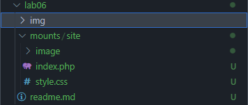

# Лабораторная работа: Развертывание PHP-приложения с Nginx и PHP-FPM в Docker

## Цель работы
Данная лабораторная работа направлена на изучение взаимодействия нескольких контейнеров в Docker и развёртывание PHP-приложения, состоящего из двух контейнеров: `nginx` и `php-fpm`. В ходе выполнения работы будет создана внутренняя сеть Docker (`internal`), настроен сервер `Nginx` для обработки PHP-запросов через `php-fpm`, а также протестировано развернутое приложение.

## Задание
1. Создать PHP-приложение на базе двух контейнеров: `nginx` и `php-fpm`.
2. Настроить внутреннюю сеть `internal` для взаимодействия контейнеров.
3. Создать контейнер `backend` с `php:7.4-fpm` и примонтированной директорией `mounts/site`.
4. Создать контейнер `frontend` с `nginx:1.23-alpine`, примонтированной директорией `mounts/site` и конфигурацией `nginx/default.conf`.
5. Открыть сайт в браузере и проверить его работу.

## Выполнение работы

### 1. Подготовка проекта
Создадим локальный репозиторий и необходимые директории:
```bash
git clone git@github.com:slendchat/c-v_usm.git 
cd c-v_usm/lab06
mkdir mounts/site
mkdir nginx
```

Создадим `.gitignore`, чтобы исключить `mounts/site/`:
```bash
echo "lab06/mounts/site/*" > .gitignore
```



### 2. Создание файла конфигурации Nginx
Создаём файл `nginx/default.conf` с конфигурацией:
```nginx
server {
    listen 80;
    server_name _;
    root /var/www/html;
    index index.php;

    location / {
        try_files $uri $uri/ /index.php?$args;
    }

    location ~ \.php$ {
        fastcgi_pass backend:9000;
        fastcgi_index index.php;
        fastcgi_param SCRIPT_FILENAME $document_root$fastcgi_script_name;
        include fastcgi_params;
    }
}
```

### 3. Создание сети Docker
Создадим внутреннюю сеть `internal`, чтобы контейнеры могли взаимодействовать:
```bash
docker network create internal
```
Вывод:
```
e7bdb2019eaa58ad30ea37595c630202fde120a8b95481c8d4412fba9dfa5147
```
Проверяем список сетей:
```bash
docker network ls
```
Вывод:
```
NETWORK ID     NAME            DRIVER    SCOPE
6abb03717c5c   bridge          bridge    local
6d2e79fc9dda   host            host      local
e7bdb2019eaa   internal        bridge    local
4fa381018da8   lab02_default   bridge    local
ff00e760b6f9   none            null      local
```

### 4. Создание контейнера `backend`
Запускаем контейнер `backend` на базе `php:7.4-fpm`:
```bash
docker run -d \
    --name backend \
    --network internal \
    -v $(pwd)/mounts/site:/var/www/html \
    php:7.4-fpm
```
Вывод:
```
Unable to find image 'php:7.4-fpm' locally
7.4-fpm: Pulling from library/php
...
Status: Downloaded newer image for php:7.4-fpm
144e868c73ae014a6f9e5daeee0093fc9d2186533b12d2abb2c2862fe36e159e
```

Данная команда запускает новый контейнер, в detached mode ( -d ),
с именем backend, подключает контейнер к сети internal ( --network ),
при помощи команды `-v $(pwd)/mounts/site:/var/www/html` монтирует сайт в `/var/www/html`, на образе php:7.4-fpm.

### 5. Создание контейнера `frontend`
Запускаем контейнер `frontend` на базе `nginx:1.23-alpine`:
```bash
docker run -d \
    --name frontend \
    --network internal \
    -p 80:80 \
    -v $(pwd)/mounts/site:/var/www/html \
    -v $(pwd)/nginx/default.conf:/etc/nginx/conf.d/default.conf \
    nginx:1.23-alpine
```
Вывод:
```
Unable to find image 'nginx:1.23-alpine' locally
1.23-alpine: Pulling from library/nginx
...
Status: Downloaded newer image for nginx:1.23-alpine
a3f1af500fb0dfd67dd6b59ec7d690e132feedba67003c79997697e9bf68393f
```

Данная команда запускает новый контейнер, в detached mode ( -d ),
с именем frontend, подключает контейнер к сети internal ( --network ),
при помощи команды `-v $(pwd)/mounts/site:/var/www/html` монтирует сайт в `/var/www/html` и конфигурацию nginx `-v $(pwd)/nginx/default.conf:/etc/nginx/conf.d/default.conf`, на образе nginx:1.23-alpine.


### 6. Проверка работы контейнеров
#### Проверяем запущенные контейнеры:
```bash
docker ps -a
```
Вывод:
```
CONTAINER ID   IMAGE               COMMAND                  CREATED         STATUS         PORTS                               NAMES
a3f1af500fb0   nginx:1.23-alpine   "/docker-entrypoint.…"   3 minutes ago   Up 3 minutes   0.0.0.0:80->80/tcp, :::80->80/tcp   frontend
144e868c73ae   php:7.4-fpm         "docker-php-entrypoi…"   5 minutes ago   Up 5 minutes   9000/tcp                            backend
```

#### Открываем сайт в браузере
Заходим в браузере по адресу `http://192.168.109.143/`.


---

## Ответы на вопросы

### 1. Каким образом в данном примере контейнеры могут взаимодействовать друг с другом?
Контейнеры взаимодействуют через внутреннюю сеть `internal`, созданную с помощью `docker network create`. В `nginx` запросы PHP передаются в `php-fpm` через `fastcgi_pass backend:9000;`, где `backend` – это имя контейнера в сети.

### 2. Как видят контейнеры друг друга в рамках сети internal?
Docker автоматически назначает контейнерам DNS-имена, совпадающие с их именами (`backend` и `frontend`). Это позволяет Nginx передавать PHP-запросы контейнеру `backend` по имени, а не по IP-адресу.

### 3. Почему необходимо было переопределять конфигурацию Nginx?
Стандартная конфигурация `nginx` не настроена для работы с `php-fpm`. Мы добавили поддержку `fastcgi_pass backend:9000;`, чтобы Nginx передавал `.php` файлы обработчику `php-fpm`.

---

## Выводы
В ходе работы мы создали PHP-приложение на основе двух контейнеров, подключенных через сеть Docker `internal`. Мы научились:
- Создавать сети для контейнеров.
- Запускать контейнеры `nginx` и `php-fpm` с нужными настройками.
- Настраивать `Nginx` для передачи PHP-запросов обработчику `php-fpm`.
- Проверять работу контейнеров и взаимодействие между ними.

В результате был развернут работающий веб-сервер с PHP, доступный на `http://192.168.109.143/`.

