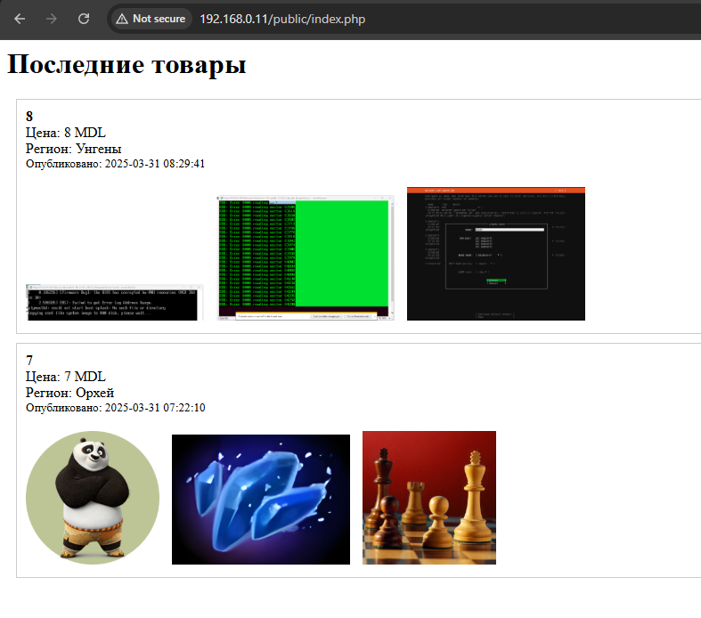

# Лабораторная работа №6: Создание многоконтейнерного приложения

## Цель работы
Ознакомиться с работой многоконтейнерного приложения на базе `docker-compose`.

## Задание
Создать PHP-приложение на базе трех контейнеров: nginx, php-fpm, mariadb, используя `docker-compose`.

## Описание выполнения работы

### 1. Подготовка репозитория и файловой структуры
Создана папка в основном репозитории `lab07`, структура проекта выглядит следующим образом:

```
lab07/
├── docker-compose.yml
├── mounts
│   └── site 
├── mysql.env
├── nginx
│   └── default.conf
└── readme.md
```

### 2. Создание конфигураций

#### Файл `.gitignore`
```
# Ignore files and directories
mounts/site/*
```

#### Конфигурация Nginx (`nginx/default.conf`)
```
server {
    listen 80;
    server_name _;
    root /var/www/html;
    index index.php;

    location / {
        try_files $uri $uri/ /index.php?$args;
    }

    location ~ \.php$ {
        fastcgi_pass backend:9000;
        fastcgi_index index.php;
        fastcgi_param SCRIPT_FILENAME $document_root$fastcgi_script_name;
        include fastcgi_params;
    }
}
```

#### Docker Compose (`docker-compose.yml`)
```yaml
version: '3.9'

services:
  frontend:
    image: nginx:1.19
    volumes:
      - ./mounts/site:/var/www/html
      - ./nginx/default.conf:/etc/nginx/conf.d/default.conf
    ports:
      - "80:80"
    networks:
      - internal

  backend:
    image: php:7.4-fpm
    volumes:
      - ./mounts/site:/var/www/html
    networks:
      - internal
    env_file:
      - mysql.env

  database:
    image: mysql:8.0
    env_file:
      - mysql.env
    networks:
      - internal
    volumes:
      - db_data:/var/lib/mysql

networks:
  internal: {}

volumes:
  db_data: {}
```

#### Переменные окружения MySQL (`mysql.env`)
```
MYSQL_ROOT_PASSWORD=secret
MYSQL_DATABASE=app
MYSQL_USER=user
MYSQL_PASSWORD=secret
```

Это файл с переменными окружения, которые автоматически попадают в контейнеры при старте.
Эти переменные читаются MySQL-контейнером при первом запуске.

### 3. Запуск контейнеров
Запуск осуществляется командой:
```
docker-compose up -d
```

### 4. Проверка работы приложения
Сайт доступен по адресу: [http://localhost](http://localhost)

### Ответы на вопросы

1. **В каком порядке запускаются контейнеры?**
   - Контейнеры запускаются параллельно, но Docker-compose автоматически учитывает зависимости сети и томов.
   - Если использовать depends_on, то контейнеры будут запускаться в определенном порядке.

2. **Где хранятся данные базы данных?**
   - Данные хранятся в Docker-томе `db_data` (volumes:db_data:/var/lib/mysql).

3. **Как называются контейнеры проекта?**
   - lab07-frontend-1 (Nginx)
   - lab07-backend-1 (PHP-fpm)
   - lab07-database-1 (MySQL)

4. **Как добавить переменную окружения APP_VERSION?**
   Нужно создать файл `app.env` с содержимым:
   ```
   APP_VERSION=1.0
   ```

   И добавить его в сервисы `frontend` и `backend` в файле `docker-compose.yml`:
   ```yaml
   frontend:
     image: nginx:1.19
     env_file:
       - app.env

   backend:
     image: php:7.4-fpm
     env_file:
       - mysql.env
       - app.env
   ```

## Результат




## Выводы
- Освоил запуск многоконтейнерных приложений с использованием Docker Compose.
- Понял, как конфигурировать взаимодействие нескольких контейнеров (nginx, php-fpm и MySQL).

## Docker-контейнеры после запуска
```
CONTAINER ID   IMAGE         COMMAND                  STATUS       PORTS                               NAMES
1531fb6ce479   php:7.4-fpm   "docker-php-entrypoi…"   Up 19s       9000/tcp                            lab07-backend-1
704448400a82   mysql:8.0     "docker-entrypoint.s…"   Up 19s       3306/tcp, 33060/tcp                 lab07-database-1
862431f68778   nginx:1.19    "/docker-entrypoint.…"   Up 18s       0.0.0.0:80->80/tcp, :::80->80/tcp   lab07-frontend-1
```
