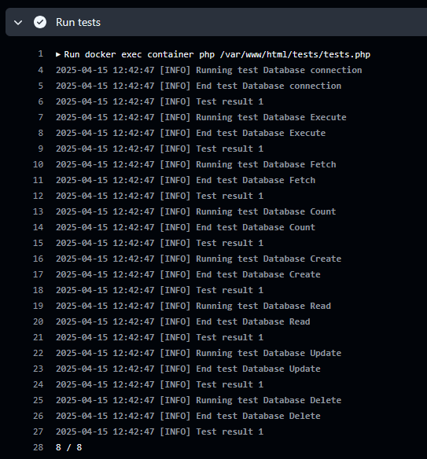

# Лабораторная работа 8: Автоматизация интеграции и тестирование с использованием Docker и GitHub Actions

## Цель работы
Цель работы – изучить процессы непрерывной интеграции (CI) и автоматической сборки Docker-образов, запуск unit-тестов через GitHub Actions.

## Задание
- Создать WEB приложение на PHP
- Создать Docker-образ проекта из директории `lab08`. 
- Настроить GitHub Actions для автоматической сборки образа, создания и запуска контейнера, копирования тестов и их выполнения.
- Написать unit-тесты для класса **Database**.
- Ответить на вопросы по непрерывной интеграции, юнит-тестированию и настройке workflow.

## Описание выполнения работы и ответы на вопросы

### Шаг 1. Подготовка проекта
- Структура проекта включает несколько лабораторных работ (lab01, lab02, …, lab08).
- В папке `lab08/site` находятся исходные коды приложения: модули (`modules`), шаблоны (`templates`) и стили (`styles`).
- Тесты для приложения размещены в папке `lab08/tests`.

### Шаг 2. Сборка Docker-образа
- В директории `lab08` находится Dockerfile, который описывает процесс сборки образа. Dockerfile копирует файлы проекта из `lab08`, устанавливает PHP, необходимые расширения и настраивает рабочее окружение.
- Для сборки образа используется команда:
  
```bash
  run: docker build -t containers08 ./lab08/
```


### Шаг 3. Настройка GitHub Actions

- Файл `.github/workflows/main.yml` настроен для запуска CI-процесса при пушах в ветку `main`.
    
- Workflow выполняет следующие шаги:
    1. **Checkout** – получение исходного кода из репозитория.
    2. **Сборка Docker-образа** – сборка образа из директории `lab08`.
    3. **Создание контейнера** – запуск контейнера с монтированным volume для хранения базы данных.
    4. **Копирование тестов** – копирование каталога тестов в контейнер.
    5. **Запуск тестов** – выполнение тестов с помощью PHP внутри контейнера.
    6. **Остановка и удаление контейнера** – очистка после тестирования.

Результат тестов:




#### Ответы на вопросы

1. Что такое непрерывная интеграция?  
Непрерывная интеграция (Continuous Integration, CI) – это практика, при которой изменения в коде регулярно интегрируются в общий репозиторий с последующим автоматическим сбором и тестированием проекта. Это помогает быстро выявлять и исправлять ошибки, повышая качество разработки.

2. Для чего нужны юнит-тесты? Как часто их нужно запускать?  
Юнит-тесты предназначены для проверки работы отдельных частей кода (функций, методов, классов). Они помогают обеспечить корректное поведение кода при любых изменениях. Юнит-тесты нужно запускать максимально часто – при каждом изменении кода, а также автоматически через систему CI (при каждом push или pull request).

3. Что нужно изменить в файле .github/workflows/main.yml для того, чтобы тесты запускались при каждом создании запроса на слияние (Pull Request)?  
Для запуска тестов при создании Pull Request необходимо добавить событие `pull_request` в секцию `on`:

```yaml
on:
  pull_request:
    branches:
      - main
```

4. Что нужно добавить в файл .github/workflows/main.yml для того, чтобы удалять созданные образы после выполнения тестов?  
После выполнения тестов можно добавить шаг, который удаляет созданный Docker-образ:

```yaml
- name: Remove Docker image
  run: docker image rm containers08
```

## Выводы

В ходе лабораторной работы были изучены:

- Принципы непрерывной интеграции и автоматизированного тестирования.
- Работа с Docker для создания контейнеризированного окружения проекта.
- Настройка и использование GitHub Actions для сборки, тестирования и очистки окружения.